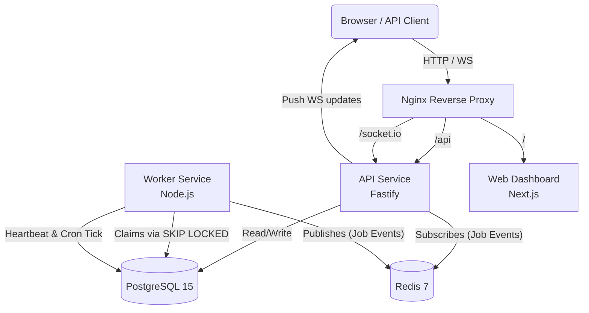

# Chronos Architecture

The system has three independently scalable processes: API Service, Worker Service, and Web Dashboard. All coordinate via PostgreSQL (source of truth) and Redis (pub/sub, rate limiting).

## System Diagram

## Data Flow Explanation

1. **Job Submission:** A client submits a job via `POST /queues/:id/jobs` to the API. The API validates the request, checks rate limits against Redis, and inserts a new row into the `jobs` table in PostgreSQL with status `queued` (or `scheduled` if `run_at` is in the future).
2. **Atomic Claiming:** The Worker Service runs a continuous polling loop. It executes a `SELECT ... FOR UPDATE SKIP LOCKED` query against PostgreSQL. This locks the claimed rows, preventing any other worker from claiming the same jobs.
3. **Execution & Lifecycle:** The Worker updates the job status to `running`, executes the payload handler, and then updates the status to `completed` or `failed`.
4. **Real-time Updates:** On every state transition (queued → claimed → running → completed), the Worker publishes a JSON event to a Redis pub/sub channel (`job:transitions`). The API Service subscribes to this channel and fans out the events to connected Web Dashboard clients via Socket.io.
5. **Crash Recovery:** Workers periodically write a heartbeat to PostgreSQL. A background reaper in the Worker Service checks for stale heartbeats. If a worker dies, the reaper marks it as `dead` and requeues any jobs that were `claimed` or `running` under that worker's ID.
6. **Cron Materialization:** A scheduler loop in the Worker Service checks `scheduled_jobs`. When a cron definition is due, it materializes a new runnable row in the `jobs` table, advancing the cron's `next_run_at`.
