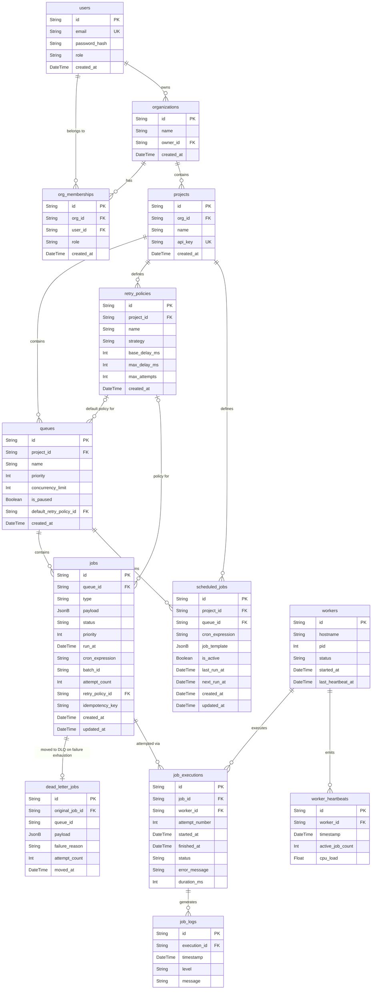

# Chronos Entity Relationship Diagram

```mermaid
erDiagram
    %% Auth & Organizations
    users {
        String id PK
        String email UK
        String password_hash
        String role
        DateTime created_at
    }

    organizations {
        String id PK
        String name
        String owner_id FK
        DateTime created_at
    }

    org_memberships {
        String id PK
        String org_id FK
        String user_id FK
        String role
        DateTime created_at
    }

    organizations ||--o{ org_memberships : has
    users ||--o{ org_memberships : "belongs to"
    users ||--o{ organizations : owns

    %% Core Hierarchy: Project -> Queue
    projects {
        String id PK
        String org_id FK
        String name
        String api_key UK
        DateTime created_at
    }

    queues {
        String id PK
        String project_id FK
        String name
        Int priority
        Int concurrency_limit
        Boolean is_paused
        String default_retry_policy_id FK
        DateTime created_at
    }

    retry_policies {
        String id PK
        String project_id FK
        String name
        String strategy
        Int base_delay_ms
        Int max_delay_ms
        Int max_attempts
        DateTime created_at
    }

    organizations ||--o{ projects : contains
    projects ||--o{ queues : contains
    projects ||--o{ retry_policies : defines
    retry_policies |o--o{ queues : "default policy for"

    %% Job Entities
    jobs {
        String id PK
        String queue_id FK
        String type
        JsonB payload
        String status
        Int priority
        DateTime run_at
        String cron_expression
        String batch_id
        Int attempt_count
        String retry_policy_id FK
        String idempotency_key
        DateTime created_at
        DateTime updated_at
    }

    scheduled_jobs {
        String id PK
        String project_id FK
        String queue_id FK
        String cron_expression
        JsonB job_template
        Boolean is_active
        DateTime last_run_at
        DateTime next_run_at
        DateTime created_at
        DateTime updated_at
    }

    dead_letter_jobs {
        String id PK
        String original_job_id FK
        String queue_id
        JsonB payload
        String failure_reason
        Int attempt_count
        DateTime moved_at
    }

    queues ||--o{ jobs : contains
    queues ||--o{ scheduled_jobs : contains
    projects ||--o{ scheduled_jobs : defines
    retry_policies |o--o{ jobs : "policy for"
    jobs ||--o| dead_letter_jobs : "moved to DLQ on failure exhaustion"

    %% Execution and Workers
    job_executions {
        String id PK
        String job_id FK
        String worker_id FK
        Int attempt_number
        DateTime started_at
        DateTime finished_at
        String status
        String error_message
        Int duration_ms
    }

    job_logs {
        String id PK
        String execution_id FK
        DateTime timestamp
        String level
        String message
    }

    workers {
        String id PK
        String hostname
        Int pid
        String status
        DateTime started_at
        DateTime last_heartbeat_at
    }

    worker_heartbeats {
        String id PK
        String worker_id FK
        DateTime timestamp
        Int active_job_count
        Float cpu_load
    }

    jobs ||--o{ job_executions : "attempted via"
    job_executions ||--o{ job_logs : generates
    workers ||--o{ job_executions : executes
    workers ||--o{ worker_heartbeats : emits
```
